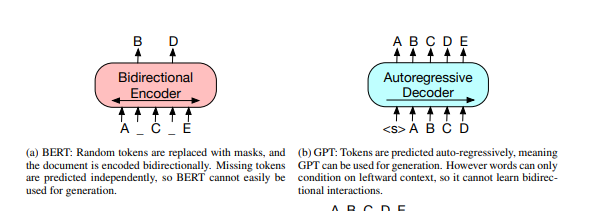
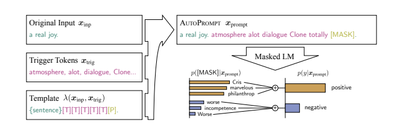
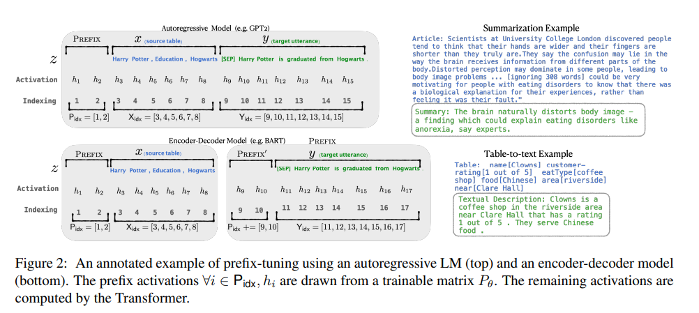

# Soft Prompts
## PEFT : Parameter-efficient Fine-Tuning
#### 3vi/2023
---
# fine tuning
  1. Fine-tuning LLMs (model tnning - all parameters are tuned during adaptation) leverages the vast knowledge acquired by LLMs and tailors it towards **specialized tasks**.
    -  BERT (due to the bidirectional encoder), GPT (with the left-to-right decoder), BART (autoencoder)

---
# Prompt tuning

  1. Effective mechanism for learning **"soft prompts"** to condition frozen language models to perform specific downstream tasks
    - **prompt ensembling** is enabled (operating with different initializations over the same data on which model was being trained)
    - Hard-prompting - manual crafted textual prompts composed of discrete input tokens. It leads to higher human interpretability.
  2. Approach outperforms GPT-3’s few-shot learning 
  3. Unlike discrete text prompts used by GPT-3, *soft prompts* are learned through **backpropagation**
---
# Prompt tuning
  1. **Propmpt tuning** (further simplification for adapting language models) matches **model tuning** state ("closes the gap") when all tasks of updating of weights are covered via **prompt design (or “priming”)** over a model
    - size of a prompt-tuned model is increasing by "freezing" pre-trained models
    - Prompts are composed of a task description and/or several canonical
    - cons : 
        - error-prone
        - human involvement
        - limited by how much conditioning text can fit into the model’s input.
1. Requiring a separate copy of the model for each downstream task examples.
    - Simultaniosly serves different tasks 
    - GPT-3 T5 XXL - 16X more parameters comparing prompt tuning
---
# Improved prompt tuning
  - Using of **AutoPrompts**  and **masked language models** instead of manual prompt design as an search algorithm over discrete space of words
  
  - Prefix tuning over generative tasks 
    - **freezing of model parameters** 
    - *backpropagating an error* 
    - tuning to prefix activations attached to each layer in the encoder stack
---
# Prompt tuning details
  - Restricting the trainable parametres to the input and output subnetworks of a masked language model (separating task-specific parameters from the "generalist" parameters) 
  -  cast all tasks as text generation
  -  probability that sequence of tokens will be represented through certain class labels
    - alongside paramtrizing by weights, transformers, 
    - when it comes to T5 model classification.
    - MLE is evaluated, while model parameters, $\theta$, fixed and gradient was applied through each conditional generation via backpropagation.
    - Finding an **optimal prompt** thus requires the selection of prompt tokens, through either manual search or non-differentiable search methods. Prompt has its own dedicated parameters, $\theta_P$ , that can be updated. 
---
# Prompt tuning details
- While prompt design involves selecting prompt tokens from a **fixed vocabulary** of **frozen embeddings** (by capturing the task definition in the prompt while keeping the generalist parameters fixed, we are able to achieve better resilience to domain shifts), prompt tuning can be thought of as using a fixed prompt of special tokens, where only the embeddings of these prompt tokens can be updated
-  **initialize** the prompt representations (random, embedding drawn from from model's vocabulary, embeddings that enumerate the output classes)
-  with smaller prompt length - there are less parameters to be tuned, and the performance is better 
- encoder decoder architecture and pre-train while unlearning **Span Corruption objective**, "reconstructing" **masked spans**, marked with **sentinel** tokens
- **Prompt ensambling** - Learning multiple prompts for the same task, can boost quality and is more efficient than classic *model ensembling*.
---
# Prefix tuning
  
  - optimizes a sequence of continuous task-specific vectors, which we call the prefix.
  - allowing subsequent tokens to attend to this prefix as if it were **virtual tokens**
  - Prompt tuning alone with no intermediate-layer prefixes or task-specific output layers is sufficient to be competitive with model tuning.
---
# Prefix tuning
- lightweight fine-tuning freezes most of the pretrained parameters and modifies the pretrained model with small trainable modules. The key challenge is to identify high-performing architectures of the modules and the subset of pretrained parameters to tune.
- **Transformers** can only condition on a
bounded-length context; **in-context** learning is unable to fully exploit
training sets longer than the context window. 
---
# Prefix tuning
- Prompt engineering has been explored as same as **BERT**
- **AutoPrompt** was also applied along side optimizes continuous prefixes, which are more expressive for the purposes of NLG. 
- Continuous vectors have been used to steer language models showed that a pretrained **LSTM language model**
- can reconstruct arbitrary sentences by optimizing continuous vector for each sentence, making the vector **input-specific**.
- Optimizes a **task-specific** prefix that applies to all instances of that task
---
# Prefix tuning

- Controllable generation aims to steer a pretrained language model to match a sentence level attribute at training time, 
- and at decoding time by weighted decoding and iteratively updating past activations
- no straightforward way to apply these controllable generation techniques to enforce fine-grained control over generated contents, as demanded by tasks like table-to-text and summarization
---
# Prefix tuning

- The autoregressive Transformer model computes activaions of all activation layers for each time step, and as a result matrix of logits of the menitioned activations. 
- BART bidirectional autoencoder was used.

- fine tuning - performing gradient
updates on the following log-likelihood objective over trainable language model distribution 
$$max_\phi\ log p_\phi(y|x) = \sum_{i\in Y_{idx}} log p_\phi (z_i|h_{<i}).$$
---
# Prefix tuning

---
# P-tuning

- designed for natural language understanding (NLU) tasks and all language models
- adds a trainable embedding tensor 
    - can be optimized to find better prompts 
---
# P-tuning
 
- it uses a prompt encoder (a bidirectional long-short-term memory network or LSTM) to optimize the prompt parameters.
-  prompt tokens are only added to the input, can be inserted anywhere in the input sequence, anchor tokens can improve performance because they indicate characteristics of a component in the input sequence